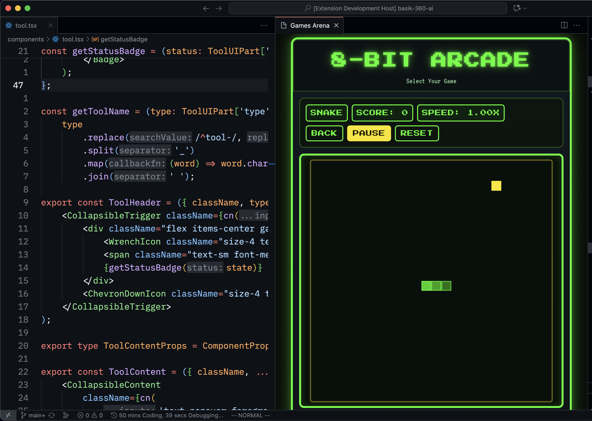
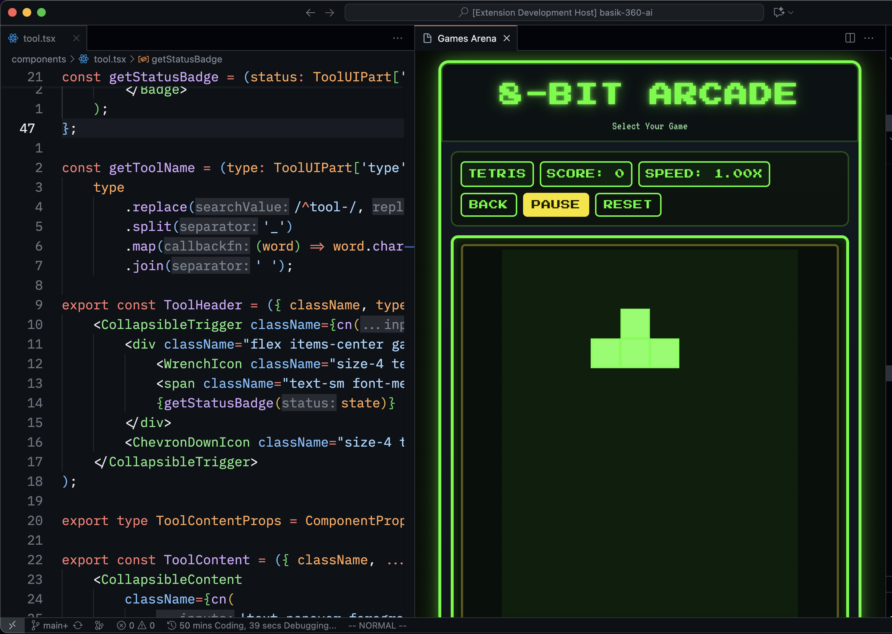

# Game Arena

Play some classic games while your AI agents are working for you.

## Features

Game Arena brings classic arcade games directly into your VS Code workspace. Take a break from coding and enjoy some nostalgic gaming without leaving your editor.

### Available Games

- **Snake** - Navigate the snake to eat food and grow longer while avoiding collisions
  
- **Tetris** - Stack falling blocks to clear lines and achieve high scores
  
- And more games coming soon!

## Getting Started

1. Install the Game Arena extension
2. Open the Command Palette (`Ctrl+Shift+P` on Windows/Linux, `Cmd+Shift+P` on macOS)
3. Type and select `Start Game Arena`
4. Choose your game and start playing!

## Release Notes

### 0.0.1

Initial release of Game Arena featuring Snake and Tetris games.

**Enjoy!**
